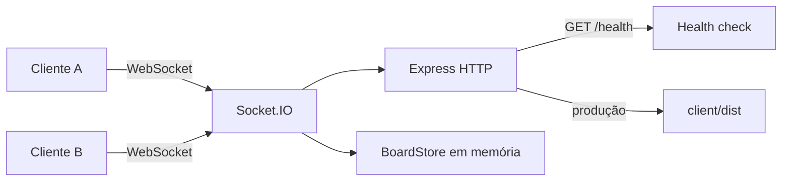

# 🟢 Realtime Kanban — React + Socket.IO + Express


Quadro Kanban colaborativo em tempo real: vários usuários no mesmo board, atualizando cartões **ao vivo** com WebSocket. Feito para portfólio — tempo real assusta iniciante, e é justamente por isso que impressiona.

## 🧠 Por que este exemplo

Kanban ao vivo é o "hello world" clássico de colaboração em tempo real porque, em pouco código, cobre os três padrões mais comuns do modelo:
- **Estado compartilhado** (todo mundo vê o mesmo quadro) → evento `board:sync`
- **Mutação com broadcast** (criar, editar, mover, apagar) → `card:*` + `activity`
- **Presença** (quem está online agora) → `join` / `presence:join` / `presence:leave`

## 🏗️ Arquitetura



O front (Vite + React) conecta no servidor (`localhost:3001` em dev). O `BoardStore` guarda colunas e cartões em memória — reiniciar o processo zera o quadro, de propósito, para o demo subir com um comando só.

## 📡 Eventos

| Direção | Evento | O que faz |
|---|---|---|
| Cliente → servidor | `join` | Entra no quadro com um nome e recebe o snapshot |
| Servidor → cliente | `board:sync` | Envia `cards` + `users` (estado completo) |
| Cliente → servidor | `card:create` / `card:update` / `card:move` / `card:delete` | Mutação no board |
| Servidor → todos | `card:created` / `card:updated` / `card:deleted` / `activity` | Replica a mudança na hora |
| Servidor → outros | `presence:join` / `presence:leave` | Atualiza quem está online |

## ✅ Testado no browser

Fluxo conferido localmente com o app rodando (`npm run dev`):
- Entrada com nome e presença (`1 online agora` + chip do usuário)
- Seed das três colunas (*A fazer / Em andamento / Concluído*)
- Criação de cartão na UI (`Publicar no GitHub`)
- Broadcast de outro cliente via Socket.IO (`Tarefa via socket` apareceu no quadro aberto)

## 🚀 Como rodar

### Pré-requisitos
- Node.js 20+
- npm

### 1. Instalar

```bash
npm install
```

### 2. Subir front + servidor juntos

```bash
npm run dev
```

- Front: [http://localhost:5173](http://localhost:5173)
- API / Socket.IO: [http://localhost:3001](http://localhost:3001)

Abra **duas abas**, entre com nomes diferentes e arraste um cartão. A outra aba atualiza na hora.

### 3. Build + servir o front pelo Express

```bash
npm run build
npm start
```

O servidor entrega o `client/dist` na porta `3001`. Variáveis opcionais:

| Variável | Padrão | Uso |
|---|---|---|
| `PORT` | `3001` | Porta do servidor |
| `CLIENT_ORIGIN` | `http://localhost:5173` | CORS do Socket.IO em desenvolvimento |
| `VITE_SOCKET_URL` | `http://localhost:3001` (dev) | URL do socket se front e server estiverem separados |

## 📦 Stack

- **React 19 + Vite + TypeScript + Tailwind CSS 4** — interface do quadro
- **Express + Socket.IO** — HTTP e canal em tempo real
- **@dnd-kit** — arrastar e soltar entre colunas

## 🗺️ Relação com o desafio

Este projeto aplica o item de **gestor de tarefas colaborativo em tempo real**: vários usuários no mesmo quadro, atualizando ao vivo com WebSocket. Não há cadastro — o nome na entrada já basta para demonstrar presença e sincronização.

---

© 2026 Gabriel Teramae Chan
